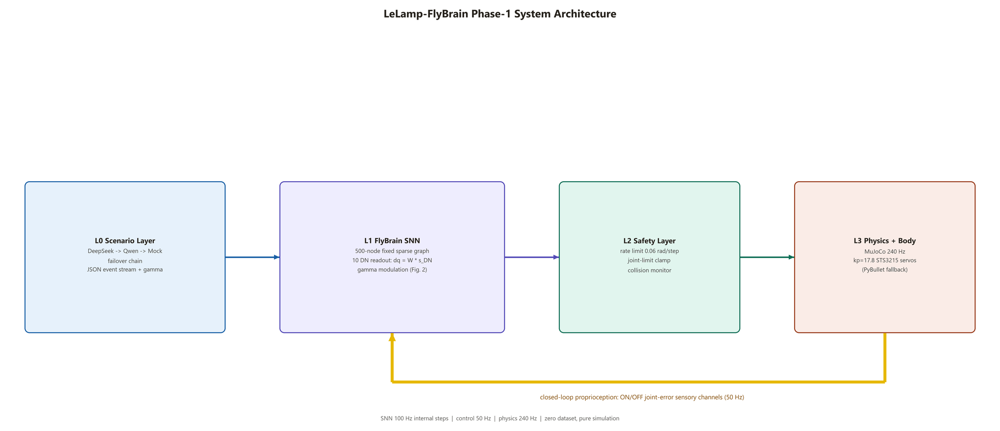
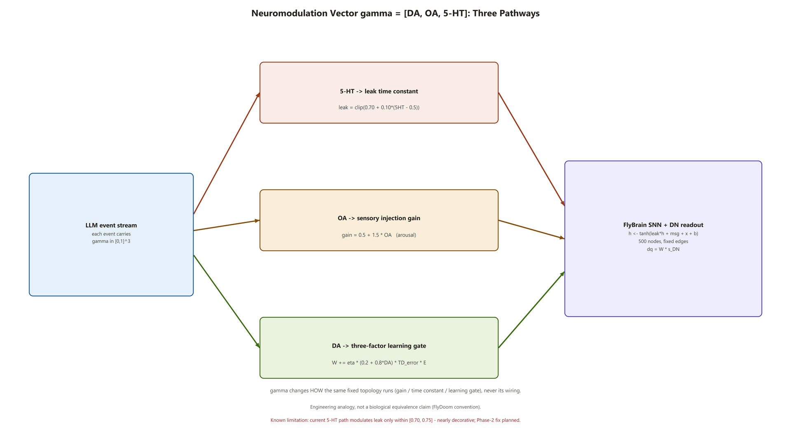
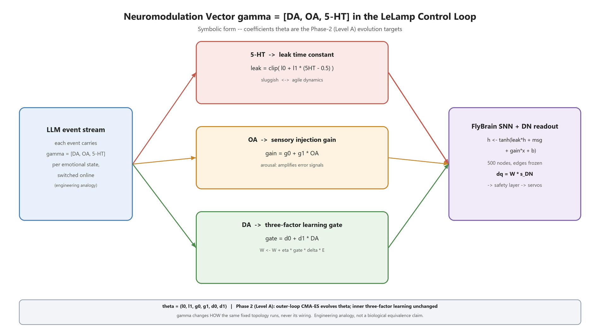
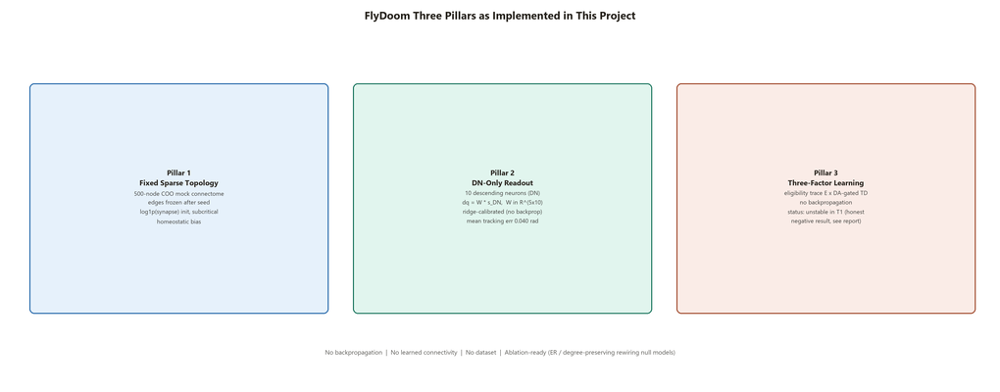
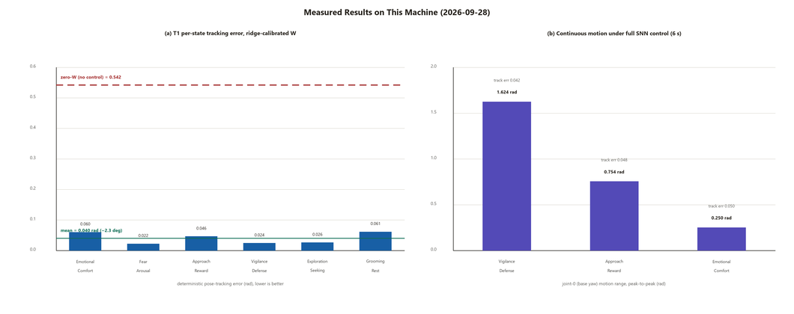

# LeLamp-FlyBrain Simulation

> A 5-DOF desk lamp driven entirely by a fixed-topology, Drosophila-inspired spiking neural network — six emotional behaviors emerge from a 10-neuron descending readout, modulated online by a γ=[DA, OA, 5-HT] neuromodulatory vector. **No backpropagation, no learned connectivity, no dataset.**

**中文文档 → [README_zh.md](README_zh.md)**



---

## Overview

**FLAMINGO / LeLamp-FlyBrain** couples two ideas:

1. **FlyDoom-style digital fly brain** — a 500-node fixed sparse recurrent network (mock connectome) whose edges never change after seeding. Behavior is produced by a **10-neuron descending-neuron (DN) readout** `dq = W · s_DN`, and modulated by a three-component neuromodulatory vector γ (three pillars: fixed topology, DN-only readout, three-factor local learning).
2. **LLM scenario layer** — DeepSeek → Qwen → local Mock failover chain that parses a natural-language situation into a timed JSON event stream carrying emotional states, γ values, LED patterns, and spoken captions.

The result: a simulated LeLamp 5-DOF robot lamp (MuJoCo, kp=17.8 STS3215 servo-fidelity model) that scans, sways, trembles, breathes and sleeps — with every joint servoed **closed-loop by the SNN itself** (joint-error ON/OFF sensory channels → SNN → DN readout → safety layer → actuators).

**Phase-1 status (2026-09-28): all three acceptance criteria met** — full pipeline runs headless; calibrated DN readout servos all six states at **0.040 rad mean tracking error** (−92.6% vs. the 0.542 rad no-control baseline); the LLM failover chain works online (DeepSeek, ~10.5 s) and offline (Mock).

## Demo

https://github.com/user-attachments/assets/361308e9-8acd-4699-bac2-9b255cedd9b1

*(Narrated 38-second demo — timestamped script in [VIDEO_DESCRIPTION.md](VIDEO_DESCRIPTION.md).)*

| Mode | Command |
|------|---------|
| GUI demo (Mock script) | `.\.venv312\python.exe main.py --mode demo` |
| **SNN full-control demo** | `.\.venv312\python.exe main.py --mode demo --controller brain --ckpt data\w_dn_calibrated.npz --engine mujoco` |
| LLM online scenario | `.\.venv312\python.exe main.py --mode online --scenario "late night, user looks tired, a cup on the desk"` |
| Headless smoke test | `.\.venv312\python.exe main.py --mode headless` |

A 38-second demo script (timestamped narration for video recording) is in [VIDEO_DESCRIPTION.md](VIDEO_DESCRIPTION.md).

### The six emotional states

| State | Pose behavior | LED | Caption | γ=[DA,OA,5-HT] |
|-------|--------------|-----|---------|----------------|
| Vigilance_Defense | Upright + 0.15 Hz slow scanning (±0.8 rad) | Ice blue, steady | "Scanning surroundings..." | [0.2, 0.5, 0.9] |
| Approach_Reward | Lean-in + 0.8 Hz cheerful head sway (±0.2 rad) | Warm yellow, steady | "Glad to be with you." | [0.8, 0.2, 0.5] |
| Fear_Arousal | Retract + 8 Hz tremor | Red, 10 Hz strobe | "Watch out! Obstacle ahead." | [0.8, 0.9, 0.2] |
| Exploration_Seeking | Low cruise + 0.4 Hz S-curve scan | Green, alternating breath | "Exploring your workspace." | [0.5, 0.5, 0.4] |
| Emotional_Comfort | Lean-forward tilt + 0.3 Hz breathing | Warm pink, slow breath (3 s) | "I am here for you." | [0.3, 0.1, 0.9] |
| Grooming_Rest | Folded, head down, still | Dim blue, 25% | (silent) | [0.1, 0.1, 0.8] |

## How it works

### γ neuromodulation — three pathways



γ is issued per-event by the scenario layer and acts on the SNN update equation `h ← tanh(leak·h + msg + x + b)`:

- **5-HT → leak time constant**: `leak = clip(0.70 + 0.10·(5HT − 0.5))` — high 5-HT = sluggish, deliberate dynamics;
- **OA → sensory injection gain**: `gain = 0.5 + 1.5·OA` — arousal; fear (OA=0.9) amplifies error signals 1.85×;
- **DA → three-factor learning gate**: `W += η · (0.2 + 0.8·DA) · TD_error · E` — dopamine marks "now is worth learning".

γ changes **how the same fixed topology runs** — never its wiring. *Engineering analogy, not a biological equivalence claim.*

The same pathways in symbolic form — the coefficients θ = (l₀, l₁, g₀, g₁, d₀, d₁) are the Phase-2 (Level A) outer-loop evolution targets (see [Roadmap](#roadmap-phase-2) and `experiments/evolve_modulation.py`):



### FlyDoom three pillars



1. **Fixed sparse topology** — 500-node COO mock connectome, edges frozen after seed, `log1p(synapse_count)` initialization, subcritical scaling, homeostatic bias;
2. **DN-only readout** — only 10 descending neurons may be read out; `W ∈ R^{5×10}` ridge-calibrated (no backprop);
3. **Three-factor local learning** — eligibility trace × DA-gated TD error; **currently unstable in T1 (honest negative result, see below)**.

## Measured results



| Channel | Mechanism | T1 deterministic eval | Verdict |
|---------|-----------|----------------------|---------|
| Ridge calibration | Least squares (non-biological) | **0.040 rad** | Architecture upper bound (demo basis) |
| LMS local delta rule | Biologically plausible, DA-gated | Stable, below bound | Best current learning path |
| Pure three-factor (E × DA) | FlyDoom core claim | 1.2–3.1 rad oscillation | **Negative result, recorded** |

Under full SNN control the lamp shows continuous visible motion (base-yaw peak-to-peak up to **1.624 rad** for vigilance scanning) while tracking error stays at 0.042–0.050 rad. All numbers measured on 2026-09-28; regenerate figures with `python tools/make_figures.py`.

## Installation

Python 3.12 is required (a conda environment is recommended):

```powershell
conda create -p .\.venv312 python=3.12 -y
.\.venv312\python.exe -m pip install numpy mujoco openai python-dotenv pillow
conda install -p .\.venv312 -c conda-forge pybullet -y   # optional 4-in-1 UI engine
```

> Windows note: on machines with Smart App Control / WDAC policies, unsigned `pybullet` binaries may be blocked — the code auto-falls back to MuJoCo; pass `--engine mujoco` to skip the attempt entirely.

### LLM keys (optional)

`.env` is **git-ignored and never uploaded**. Copy the template and fill in your own keys:

```powershell
copy .env.example .env
# DEEPSEEK_API_KEY=...   (primary, https://api.deepseek.com)
# DASHSCOPE_API_KEY=...  (fallback, Qwen-Max)
```

Without keys, everything still runs via the local Mock event stream — `--mode demo` is fully offline.

## Repository structure

```
├── assets/                 # Fixed-base URDF + MJCF (official joint limits, kp=17.8 STS3215)
├── configs/                # All tunables (SNN, safety, rewards, LLM endpoints)
├── core/                   # connectome / fly_brain / dn_readout / states / safety
├── sim/                    # MuJoCo env (primary) + PyBullet 4-in-1 env (fallback)
├── utils/                  # LLM failover client + 3 local Mock scenario scripts
├── experiments/            # calibrate_readout.py, train_t1.py
├── tools/make_figures.py   # Pure-Pillow figure regeneration (matplotlib blocked on some hosts)
├── docs/figures/           # Figures used by this README and the progress report
├── data/                   # Checkpoints + training curves (*.csv)
├── RUN_GUIDE.md            # Step-by-step tutorial with measured outputs & troubleshooting
├── VIDEO_DESCRIPTION.md    # Timestamped narration for the demo video
└── README4me.md            # Original personal notes (kept for reference)
```

## Roadmap (Phase 2)

| # | Item | Goal |
|---|------|------|
| P2-1 | Ablation matrix | mock / ER / degree-preserving-rewired graphs × ≥5 seeds, effect sizes |
| P2-2 | Three-factor stability | Loop-delay analysis, error dead-zone, non-degenerate DA gating — converge to LMS level |
| P2-3 | 5-HT pathway fix | Re-calibrate leak modulation beyond the decorative [0.70, 0.75] range |
| P2-4 | Neuromodulation evolution | **Implemented** ✅ `experiments/evolve_modulation.py`: outer CMA-ES over θ = γ-mapping coefficients (LAPACK-free hand-Jacobi eigensolver), inner three-factor loop unchanged; anti-gaming constraints (fitness includes learning-speed AUC; degenerate-gate penalties). Smoke-tested; formal run pending |
| P2-5 | T2/T3 tasks | Obstacle approach (RRT-Connect), state-transition smoothness |
| P2-6 | Real-robot transfer | STS3215 calibration, sim-to-real gap, human-preference data for γ fine-tuning |

## Honest limitations

- γ's three pathways are an **engineering analogy**, not a biological equivalence claim;
- The 5-HT path modulates leak only within [0.70, 0.75] under the Phase-1 hand-set θ — nearly decorative; the coefficients are now **evolvable** (P2-4 implemented) but not yet re-optimized;
- Emotional pose targets are **hand-designed behavioral priors**; Phase 1 proves the fixed-topology + DN-readout architecture can *servo* them, not that they emerge;
- The mock connectome is a random graph — real FlyWire/MaleCNS wiring is future work;
- Pure three-factor learning has **not converged** in T1 (negative result, consistent with FlyDoom's "negative results count" stance);
- Earlier Gemini-generated KPIs had no on-machine evidence and are treated as design targets only.

## References & acknowledgments

This project builds on public code, ideas and papers — sincere thanks to:

**Hardware & embodiment**
- [LeLamp](https://github.com/humancomputerlab/LeLamp) (GPL-3.0) & `lelamp_runtime` — lamp hardware, STS3215 servo parameters, URDF source
- Liu et al., 2025 — [*ELEGNT: Expressive and Functional Movement Design for Non-Anthropomorphic Robot*](https://arxiv.org/abs/2501.12493) (Apple) — expressive-motion methodology behind LeLamp
- [LeRobot](https://github.com/huggingface/lerobot) (Hugging Face) — framework under lelamp_runtime

> **Citation note**: if you use this project in academic work, please explicitly cite the official LeLamp repository and the ELEGNT paper above, in addition to this repository.

**Drosophila connectome & digital brains**
- [FlyDoom](https://github.com/eganeganegan/flydoom) — the direct source of our three-pillar framework and the "negative results count" experimental stance
- [awesome-fly](https://github.com/cobanov/awesome-fly) — survey of connectome-driven controllers; ablation-baseline design reference
- FlyWire (Dorkenwald et al., *Nature* 2024) & MaleCNS (*Cell*, 2026-09) — real connectome data (future integration targets)
- [Shiu et al. Drosophila_brain_model](https://github.com/philshiu/Drosophila_brain_model) & [Eon Systems fly-brain](https://github.com/eonsystemspbc/fly-brain) — connectome LIF whole-brain implementations
- [flybody](https://github.com/TuragaLab/flybody) (TuragaLab / DeepMind / HHMI Janelia) & [FlyGym / NeuroMechFly](https://github.com/NeLy-EPFL/flygym) (NeLy-EPFL) — embodied fly physics
- Frémaux & Gerstner (2016) — three-factor learning rules (neuromodulated STDP) review

**Simulation & LLM infrastructure**
- MuJoCo (Todorov et al., 2012) & PyBullet (Coumans & Bai) — dual physics engines
- DeepSeek API & Qwen (DashScope) — scenario-generation failover chain
- Google Gemini — early design-draft assistance (its KPI claims downgraded per above)

## License & Copyright Statement

**This research uses and adapts the LeLamp hardware design, which is open-sourced under the GPL-3.0 license.**

The hardware design in this project is developed from / derived from the upstream [LeLamp](https://github.com/humancomputerlab/LeLamp) project. In accordance with the **GNU General Public License v3.0 (GPL-3.0)**:

1. **Copyleft**: the hardware assets of this project (including but not limited to circuit schematics, PCB layouts, 3D models, and the derived simulation URDF/MJCF models) are likewise released in full under **GPL-3.0**.
2. **Attribution & disclaimer**: the original LeLamp authors' copyright notices are retained. This project is likewise provided on an **"AS IS"** basis, without warranty of any kind, either express or implied.
3. **Modifications**: we made the following changes to the original design:
   - replaced the floating base with a **fixed base** (simulation grounding);
   - rebuilt the kinematic tree as a **single serial chain** (removed redundant fixed joints);
   - adopted the **official joint limits** and **kp = 17.8 STS3215** servo parameters;
   - ASCII-ized STL mesh filenames (originally non-ASCII names);
   - added a **MuJoCo MJCF model** (upstream provides URDF only);
   - added the control stack that does not exist upstream: the FlyDoom-style SNN controller, γ neuromodulation, and the LLM scenario layer.

> This repository is a **pure software simulation** and does not redistribute LeLamp's PCB/CAD manufacturing files; `assets/` contains simulation models rebuilt from the upstream hardware parameters. The license of the original software written for this repository (SNN controller, simulation pipeline) will be specified separately; note that distributing the derived hardware assets remains governed by GPL-3.0, and adopting GPL-3.0 for the whole repository is the lowest-friction compliant choice.

**Upstream project**: [LeLamp official repository](https://github.com/humancomputerlab/LeLamp) · [ELEGNT paper (Apple, 2025)](https://arxiv.org/abs/2501.12493)
