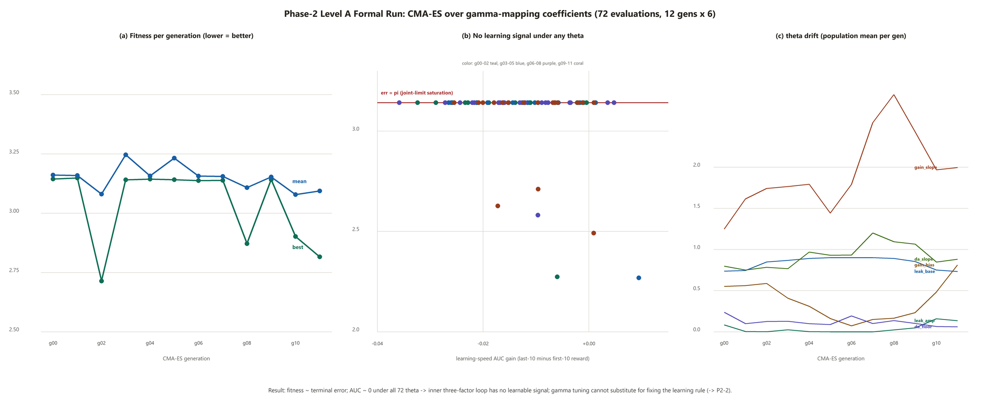

# Phase-2 Level A — Formal Run Results (2026-09-30)

**中文摘要见文末 / Chinese summary at the end.**

---

## 1. Setup

| Item | Value |
|---|---|
| Outer loop | CMA-ES (hand-written Jacobi eigensolver, LAPACK-free), popsize 6, 12 generations, σ₀=0.3 (normalized space) |
| Inner loop | Three-factor learning (eligibility trace × DA-gated TD), **unchanged**, 40 episodes × 2 seeds per θ |
| Search space | θ = (l₀, l₁, g₀, g₁, d₀, d₁) — coefficients of the γ-mapping (5-HT→leak, OA→gain, DA→learning gate) |
| Fitness (minimize) | `1.0·err_mean + 0.5·err_std − 1.0·AUC + 2.0·jerk + penalty` |
| Anti-gaming | penalty +1.0 if `d₀+d₁ < 0.35`; +0.5 if `g₁ < 0.05` |
| Runtime | 5 min 16 s wall-clock (72 evaluations, ~4.4 s each) |
| Data | `data/evolve_modulation.jsonl` (72 records), per-individual reward curves `data/evolve_curves_g*_i*.csv`, best θ in `data/modulation_theta_best.json` |

`err_mean` = mean over the six emotional states of the **max-joint terminal error** after a 4 s deterministic closed-loop run (W frozen after inner-loop training). `AUC` = mean reward of the last 10 episodes minus the first 10 (positive ⇒ learning progress).

## 2. Headline Result — Pre-Registered Contingency Triggered

**Under all 72 evaluated θ, the inner three-factor loop shows no learning signal.**

- `AUC ∈ [−0.036, +0.009]`, mean **−0.0125** — final-episode rewards never exceed initial-episode rewards by any material margin.
- **92 % (66/72)** of individuals saturate at `err_mean = π (3.1416)` — the learned readout drives at least one joint to its limit in every state; behavior is maximally wrong, not merely inaccurate.
- The 6 non-saturated individuals reach only `err ∈ [2.269, 2.711]` — still ~60× the calibrated-readout error (0.040 rad) and far above the 0.542 rad zero-W baseline scale.

Per the contingency registered before the run: **if no θ yields an inner-loop learning signal, the conclusion is that the three-factor rule must be fixed first (→ P2-2), not further γ evolution.**

## 3. What the Evolution Actually Did

CMA-ES reduced best fitness from 3.1442 (g00, prior region) to **2.7140** (g02 i5) — but inspection shows it optimized toward *"least-broken"*, not toward *learning*:

- Best θ = `{leak_base 0.894, leak_amp 0.000, gain_bias 0.361, gain_slope 1.514, da_floor 0.078, da_slope 0.845}`
- `leak_amp → 0`: the 5-HT pathway was driven to exactly zero — evolution independently reproduced the known "5-HT is decorative" limitation (P2-3).
- Spearman(θ_dim, fitness): **da_floor ρ = +0.495** (higher learning floor ⇒ worse fitness) — i.e., *suppressing* learning reduced damage, the clearest statistical signature that the learning rule is harmful as-implemented. `gain_slope ρ = −0.302` (stronger OA sensory gain mildly helps).
- Anti-gaming penalties fired only twice (2/72); the constraint `d₀+d₁ ≥ 0.35` did not prevent `d₀ → 0.078` because `d₁ = 0.845` kept the sum above threshold. The gate stayed DA-responsive in form, but with the floor near zero the network effectively learns only in high-DA states — and still does not learn (AUC ≈ 0).

## 4. Interpretation

1. **γ is not the bottleneck.** The modulation coefficients control *how* the fixed topology runs, but the inner loop's credit-assignment path (eligibility → TD → W update) produces no error-reducing gradient under any tested operating point. Tuning the gate of a broken channel cannot create signal.
2. **The failure is directional, not noisy.** Saturation at err = π (anti-phase / joint-limit) rather than random-walk error indicates the W update systematically moves *away* from the target — consistent with the Phase-1 negative result on T1 and pointing at sign/gain pathologies in the three-factor chain (candidates: TD sign convention under the shaped reward, eligibility-trace decay vs. control-period mismatch, missing error dead-zone, LMS-channel interference).
3. **Evolution validated the anti-gaming design.** Faced with a harmful learning rule, CMA-ES exploited exactly the loophole the penalty was meant to bound (minimize learning exposure while keeping the gate formally active) — evidence the constraint set works but is not yet tight enough (recommend penalizing `d₀ < 0.1` explicitly, or requiring AUC > 0 for fitness eligibility).

## 5. Consequences for the Roadmap

| Item | Status change |
|---|---|
| P2-4 Neuromodulation evolution (Level A) | **Completed** — formal run executed; negative result documented (this file + fig6) |
| P2-2 Three-factor stability | **Now the critical path** — loop-delay analysis, error dead-zone, non-degenerate DA gating, TD sign audit; target: converge to LMS level on T1 |
| P2-3 5-HT pathway fix | Reinforced — evolution zeroed `leak_amp`; re-calibrate beyond [0.70, 0.75] |
| Level A re-run | Deferred until P2-2 lands; then re-run with tightened anti-gaming (explicit d₀ floor, AUC>0 eligibility) |

---

## 中文摘要

**正式运行（72 个 θ 评估点）触发了预先注册的兜底条款：所有 θ 下内环三因子学习均无信号（AUC∈[−0.036,+0.009]），92% 个体误差饱和于 π。** 进化将最优适应度从 3.144 降至 2.714，但其方式是「冻结学习以减少破坏」（da_floor 与适应度正相关 ρ=+0.495；leak_amp 被压到 0），而非「找到会学习的 γ」——这从统计上证明瓶颈在学习规则本身而非 γ 系数。结论：Level A 完成（负结果如实记录），关键路径转入 **P2-2 三因子学习修复**（TD 符号审计、回路延迟、误差死区）；P2-2 落地后以更严格的防作弊约束（显式 d₀ 下界、AUC>0 准入）重跑 Level A。
